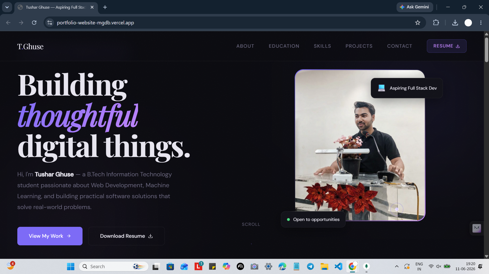
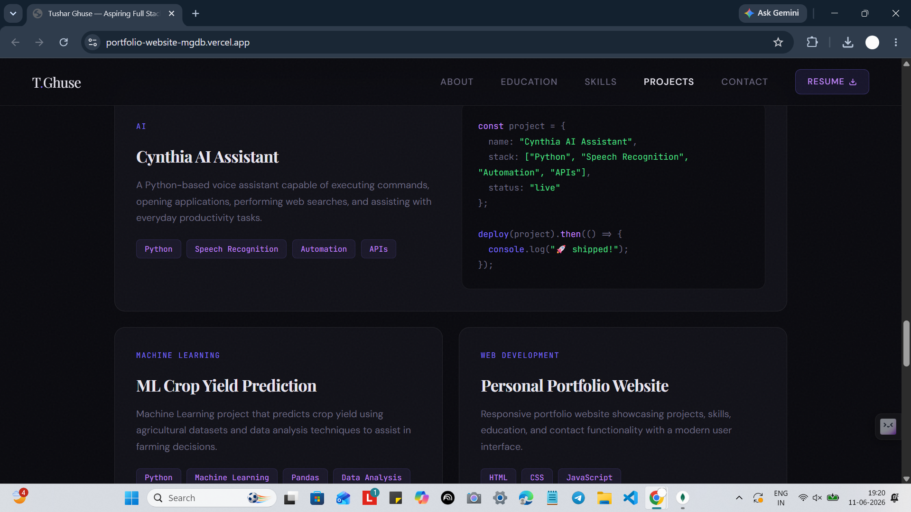
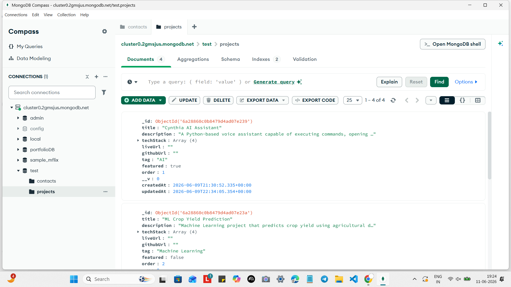
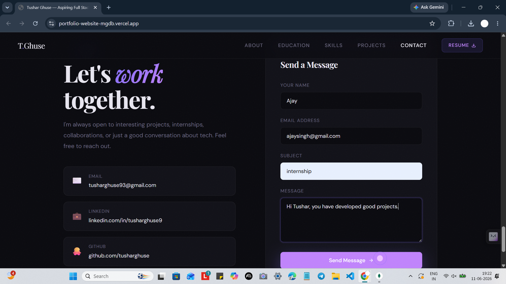
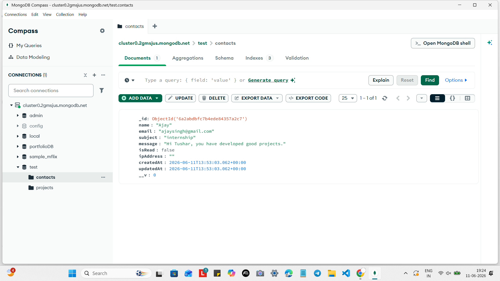

# 🌐 Tushar Ghuse Portfolio Website

A modern full-stack portfolio website built to showcase my projects, skills, achievements, and development journey as an Information Technology student and web developer.

## 🚀 Live Demo

Frontend (Vercel): https://portfolio-website-mgdb.vercel.app/

## ✨ Features

* Modern and responsive design
* Project showcase section
* Skills and technology stack
* About Me section
* Contact form integration
* Full-stack architecture
* REST API backend
* Mobile-friendly interface

## 🛠️ Tech Stack

### Frontend

* HTML5
* CSS3
* JavaScript
* Responsive Design

### Backend

* Node.js
* Express.js

### Database

* MongoDB

### Deployment

* Vercel (Frontend)
* Render (Backend)

## 📂 Project Structure

```text
portfolio-website/
├── frontend/
├── backend/
│   ├── controllers/
│   ├── routes/
│   ├── models/
│   ├── config/
│   └── server.js
└── README.md
```

## ⚙️ Installation

### Clone Repository

```bash
git clone https://github.com/tusharghuse/portfolio-website.git
```

### Install Dependencies

```bash
cd backend
npm install
```

### Run Backend

```bash
npm start
```

## 🎯 Purpose

This portfolio website was developed to:

* Showcase my web development projects
* Demonstrate full-stack development skills
* Present my technical abilities and achievements
* Build a professional online presence

## 👨‍💻 About Me

I'm Tushar Ghuse, an Information Technology student passionate about web development, software engineering, and building practical projects that solve real-world problems.

## 🔗 Links

* Live Website: https://portfolio-website-mgdb.vercel.app/
* GitHub: https://github.com/tusharghuse

## ⭐ If you like this project

Consider giving the repository a star and sharing feedback.

## 📸 Screenshots

### 🏠 Homepage

Main landing page of the portfolio website showcasing personal branding, navigation, and key highlights.



---

### 📂 Projects Section

Projects are dynamically fetched from the backend and displayed on the website.




---

### 🗄️ MongoDB Projects Collection

MongoDB database storing project information that is served through the backend API and rendered on the website.



---

### 📝 Contact Form

Interactive contact form allowing visitors to send messages and connect directly.



---

### 📬 MongoDB Contact Messages Collection

Contact form submissions are stored securely in MongoDB and can be managed through the backend API.




